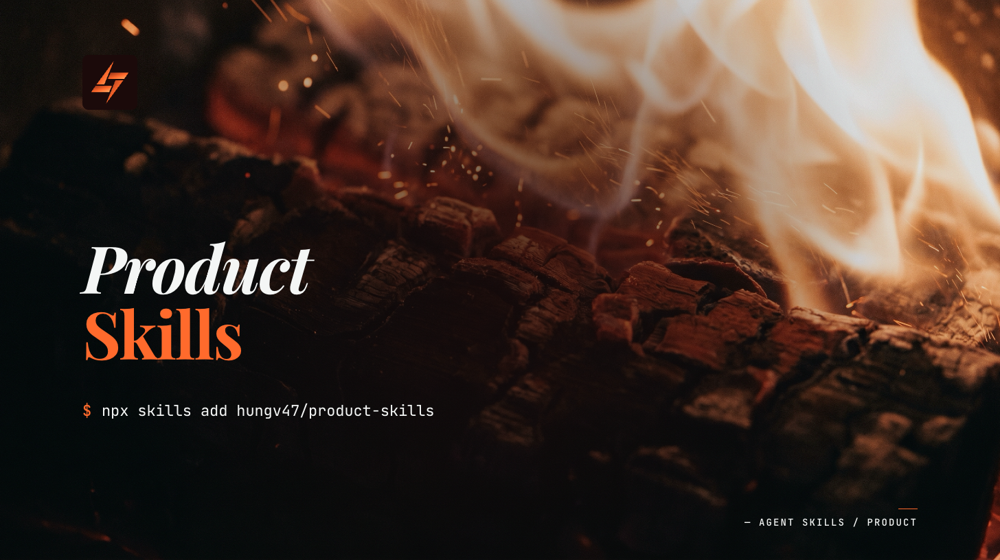

# Product Skills



> **Agent Skills 2.0** — fresh start on the `refactor/v2.0` branch. Install via `npx skills add hungv47/product-skills@refactor/v2.0`. The `main` branch holds the legacy v6.x line.

UX design, technical architecture, code cleanup, machine cleanup, and documentation — the skills for designing and building software. 6 skills (incl. `/orchestrate-product` orchestrator).

**New here?** Run `/orchestrate-product` — it reads project state (spec, flows, architecture), parses your ask, and proposes the next skill to invoke with rationale.

## Install

Installs via the [`skills` CLI](https://skills.sh). Requires Node.js 18+. Auto-detects Claude Code, Cursor, Codex, Windsurf, Gemini CLI, or VS Code.

```bash
# Install the full product stack (Agent Skills 2.0)
npx skills add hungv47/product-skills@refactor/v2.0

# Cherry-pick a single skill (any skill in the stack — these are just examples)
npx skills add hungv47/product-skills@refactor/v2.0 --skill code-cleanup
npx skills add hungv47/product-skills@refactor/v2.0 --skill system-architecture
npx skills add hungv47/product-skills@refactor/v2.0 --skill user-flow

# List available skills without installing
npx skills add hungv47/product-skills@refactor/v2.0 --list

# Target a specific editor
npx skills add hungv47/product-skills@refactor/v2.0 --agent claude-code

# Install globally (available in every project)
npx skills add hungv47/product-skills@refactor/v2.0 -g
```

**Legacy v6.x install** (main branch — no `@refactor/v2.0` suffix):

```bash
npx skills add hungv47/product-skills
```

See the [root README](https://github.com/hungv47/agent-skills#install) for the full install reference.

### Alternative: Claude Code plugin

For Claude Code users who prefer the native plugin system:

```
/plugin marketplace add hungv47/agent-skills
/plugin install product-skills@agent-skills
```

Skills are then namespaced — call them as `/product-skills:user-flow`, `/product-skills:system-architecture`, etc. **`npx skills add` is recommended for most users** (editor-agnostic, no namespace prefix, per-skill cherry-pick). Plugin path is Claude Code only.

## Pipeline

<picture>
  
</picture>

## Skills

### `user-flow` — map the screens

Maps multi-step in-product flows — screens, decisions, transitions, platform-native touchpoints (dock, menu bar, widgets, notifications, Live Activity, Dynamic Island, Quick Settings, etc.), edge cases, and error states for features or user journeys. Enumerates target platforms and per-platform surfaces explicitly; no "cross-platform" shortcuts.

**Use when:**
- You're designing a new feature and need to think through every screen, every platform surface, and every user path
- You want to catch edge cases (errors, empty states, permissions, widget throttling, Live Activity ceilings, Web Push fallback) before building
- You need a visual reference that developers can implement from
- You ship on multiple platforms and need to map how the flow surfaces on each (dock, menu bar, widgets, notifications, share sheet, deep links…)

**Not for:** visual brand design (use `brand-system`) or landing-page architecture (use `lp-brief`)

**Produces:** `.agents/skill-artifacts/product/flow/<flow-name>.md` — one file per flow (checkout.md, onboarding.md, etc.) plus an auto-generated `index.md` when ≥2 flows exist

---

### `system-architecture` — design the technical system

Technical blueprints — tech stack selection, database schema, API design, file structure, deployment plan, and security review (STRIDE threat model + OWASP Top 10 + LLM security). Classifies every external dependency into four categories (in-process, local-substitutable, remote-owned, true-external) to directly inform testing strategy.

**Use when:**
- You know what to build and need to decide *how* — the technical design
- You want a database schema, API contracts, and deployment plan before writing code
- You need to evaluate tech stack trade-offs for a specific product

**Not for:** unclear requirements (use `discover`) or task decomposition (use `task-breakdown`)

**Produces:** `architecture/system-architecture.md`

---

### `code-cleanup` — audit and refactor existing code

Structural audit, AI slop removal (code-level and frontend/visual), dead code detection, unused/broken/duplicate asset scanning, and refactoring — without changing behavior.

**Use when:**
- Your codebase has accumulated cruft and needs a quality pass
- You want to remove AI-generated patterns that hurt readability
- You need to identify dead code, unused dependencies, unused assets, or structural issues

**Not for:** diagnosing business problems (use `diagnose`) or writing documentation (use `docs-writing`)

**Produces:** `.agents/skill-artifacts/meta/records/cleanup-*.md` + in-place fixes

---

### `docs-writing` — generate documentation from code

READMEs, API references, setup guides, runbooks, and architecture docs with consistent structure and terminology. Ship log mode (`--ship-log`) writes a plain-language product snapshot to `research/product-context.md` so agents and humans know what the app does. Sync mode (`--sync`) updates existing docs after code changes.

**Use when:**
- You have a codebase and need documentation generated from it
- You want API references, setup guides, or runbooks that stay accurate to the code
- You need a product snapshot that downstream skills can use as context
- You need contributor documentation for an open-source project

**Not for:** specifying what to build (use `discover`) or restructuring code (use `code-cleanup`)

**Produces:** Documentation files directly in the project (README.md, docs/) or `research/product-context.md` (ship log mode)

---

## Cross-Stack

- `system-architecture` reads `.agents/skill-artifacts/meta/sketches/prioritize-*.md` (from [research-skills](https://github.com/hungv47/research-skills)) and every `.agents/skill-artifacts/product/flow/*.md` for cross-stack context
- `system-architecture` and `docs-writing` read `research/product-context.md` from research-skills
- `docs-writing --ship-log` writes `research/product-context.md`, the canonical cross-stack artifact consumed by 12+ downstream skills
- `user-flow` output feeds into `system-architecture` and `task-breakdown` (from [meta-skills](https://github.com/hungv47/meta-skills))

## Releases

```bash
# Update to latest version (if already installed)
npx skills update

# Add this stack to your project
npx skills add hungv47/product-skills
```

## Changelog

Full release history with per-version notes: [product-skills/releases](https://github.com/hungv47/product-skills/releases)

## License

MIT
